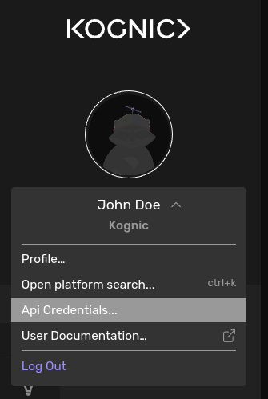

import Tabs from "@theme/Tabs";
import TabItem from "@theme/TabItem";

# Quickstart

Kognic provides a client called [kognic-io](https://pypi.org/project/kognic-io/) to simplify calling our APIs using Python.

## Installation
Install via pip:

<Tabs>
  <TabItem value="kognic-io-installation" label="kognic-io" default>
    Install `kognic-io` for the most common use cases like file uploads and project management.
    ```bash
    pip install --upgrade kognic-io
    ```
  </TabItem>
  <TabItem value="kognic-auth-installation" label="kognic-auth" default>
    Not needed for file uploads. Install `kognic-auth` if you intend to use [Dataset exploration](../dataset-exploration/introduction.md) or [Annotation integration](../annotation-integration/introduction.md).
    ```bash
    pip install --upgrade kognic-auth
    ```
  </TabItem>
</Tabs>


## Generating credentials

In the main platform, credentials can be generated by clicking here in the user menu.



## Setting credentials

Set the environment variable `KOGNIC_CREDENTIALS` to point to it.

```bash
export KOGNIC_CREDENTIALS=~/path/to/credentials.json
```

## Verify credentials

To verify that they are correct you can simply list projects in Python:

::::note
Since kognic-io v2.4.0 you can provide a workspace id that will be used for writes.
For users with multiple workspaces this will be mandatory. [See](../kognic_apis.md#specifying-a-workspace) 
::::

<Tabs>
  <TabItem value="kognic-io-verify" label="kognic-io" default>
    ```python
    from kognic.io.client import KognicIOClient

    client = KognicIOClient()
    client.project.get_projects()
    print("success")
    ```

  </TabItem>
  <TabItem value="kognic-auth-verify" label="kognic-auth" default>
    ```python
    from kognic.auth.requests.auth_session import RequestsAuthSession

    client = RequestsAuthSession()
    client.session.get("https://input.app.kognic.com/v1/projects").raise_for_status()
    print("success")
    ```

  </TabItem>
</Tabs>

You should now be set up to interact with the Kognic Platform.

## Next steps

- [Upload your first scene](../upload-data/upload-your-first-scene.mdx): Quick guide on how to upload data to the Kognic Platform
- [Key concepts](../key_concepts.md): Learn about the key concepts of the Kognic Platform
