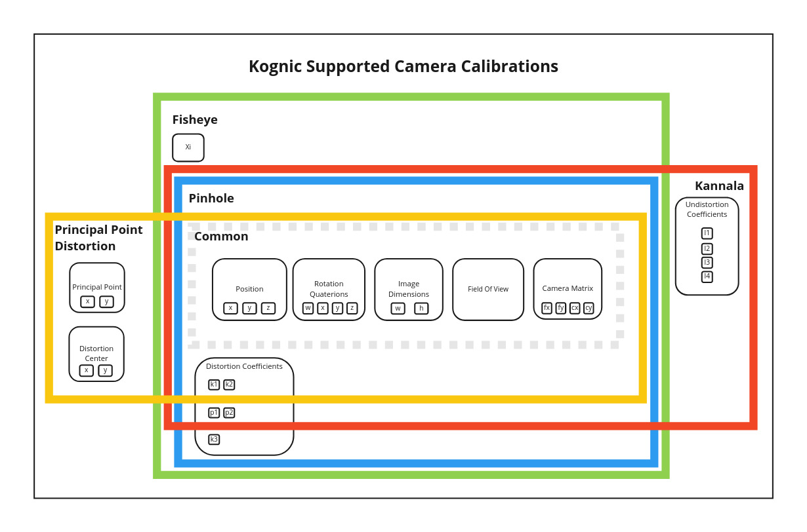

Scenes including both a 2D and 3D representation such as `lidars_and_cameras` deal with data in a number of different 
[coordinate systems](coordinate_systems.md). These scenes require a calibration that relate the different sensors to
each other in terms of location and orientation. The calibration should also contain the required information for 
projecting 3D points into the image plane of the camera.

A `Calibration` object consists of a set of key-value pairs where the key is the name of the sensor (i.e. sensor name) 
and the value is either a `LidarCalibration` object or any of the different camera calibrations.

:::tip reuse calibration
Note that after a calibration has been created you can, and should, reuse the same calibration for multiple scenes if possible.
:::

## Lidar

| Key                        | Value                         | Parameters                                                 |
|:---------------------------|:------------------------------|:-----------------------------------------------------------|
| `rotation_quaternion`      | A `RotationQuaternion` object | `w`, `x`, `y`, `z`                                         |
| `position`                 | A `Position` object           | `x`, `y`, `z`                                              |
| `field_of_view` (optional) | A `LidarFieldOfView` object   | `start_angle_deg`, `stop_angle_deg` and optionally `depth` | 

A LIDAR calibration is represented as a `LidarCalibration` object and consists of a position expressed with three coordinates and a rotation
in the form of a [Quaternion](https://en.wikipedia.org/wiki/Quaternions_and_spatial_rotation). Optionally, the sensor's field of view may be
specified by providing an object that has a sweep start angle and sweep stop angle. The field of view may also optionally include the depth
to which the field extends.

See the code example below for creating a base `LidarCalibration` object.

```python reference
https://github.com/annotell/annotell-python/blob/master/kognic-io/examples/calibration/create_lidar_calibration.py
```

## Camera
The Camera calibration format is based on [OpenCVs](https://docs.opencv.org/3.4/d4/d94/tutorial_camera_calibration.html) format and
this [paper](http://www.robots.ox.ac.uk/~cmei/articles/single_viewpoint_calib_mei_07.pdf). The different camera types supported are: `PINHOLE`, `FISHEYE`, `KANNALA` and `PRINCIPALPOINTDIST`.



### Common

All camera calibrations have the following attributes


| Key                   | Value                         | Parameters             |
|:----------------------|:------------------------------|:-----------------------|
| `rotation_quaternion` | A `RotationQuaternion` object | `w`, `x`, `y`, `z`     |
| `position`            | A `Position` object           | `x`, `y`, `z`          |
| `camera_matrix`       | A `CameraMatrix` object       | `fx`, `fy`, `cx`, `cy` |
| `image_width`         | Integer                       | NA                     |
| `image_height`        | Integer                       | NA                     |
| `field_of_view`       | Float                         | NA                     |

### Pinhole

The `PINHOLE` camera model expands the common model with:

| Key                       | Value                             | Parameters                   |
|:--------------------------|:----------------------------------|:-----------------------------|
| `distortion_coefficients` | A `DistortionCoefficients` object | `k1`, `k2`, `p1`, `p2`, `k3` |

```python reference
https://github.com/annotell/annotell-python/blob/master/kognic-io/examples/calibration/create_pinhole_calibration.py
```

### Fisheye
The Fisheye camera model expands the `PINHOLE` model with the following

| Key  | Value | Parameters |
|:-----|:------|:-----------|
| `xi` | Float | NA         |

```python reference
https://github.com/annotell/annotell-python/blob/master/kognic-io/examples/calibration/create_fisheye_calibration.py
```


### Kannala
The `KANNALA` camera model changes and expands the `PINHOLE` with the following

| Key                         | Value                                                                                                                                 | Parameters       |
|:----------------------------|:--------------------------------------------------------------------------------------------------------------------------------------|:-----------------|
| `distortion_coefficients`   | A `KannalaDistortionCoefficients` object. <br/> Note that it is a subset of the `DistortionCoefficients`, omitting the `k3` parameter | `k1`, `k2`, `p1`, `p2` |
| `undistortion_coefficients` | A `UndistortionCoefficients` object.                                                                                                  | `l1`, `l2`, `l3`, `l4` |

```python reference
https://github.com/annotell/annotell-python/blob/master/kognic-io/examples/calibration/create_kannala_calibration.py
```

### Principal point distortion

The principal point distortion model consists of the common attributes plus

| Key  | Value | Parameters |
|:-----|:------|:-----------|
| `principal_point_distortion_coefficients` | A `PrincipalPointDistortionCoefficients` object |`k1`, `k2` |
| `distortion_center` | A `DistortionCenter` object |`x`, `y` |
| `principal_point` | A `PrincipalPoint` object |`x`, `y` |


### Example: Creating a calibration

The following example code shows how you can create a *unity* (i.e. we assume that all sensors are placed at origin and have no rotation)
calibration for a LIDAR sensor and several camera sensors of type `PINHOLE`.

```python reference
https://github.com/annotell/annotell-python/blob/master/kognic-io/examples/calibration/calibration.py
```

### Listing existing calibrations

As a final step we can fetch the calibration via the external id. This can either be done via the client, or via the CLI 
kognicutil tool.

```python
client.calibration.get_calibration(external_id="Collection 2020-06-16")
```

```bash
$ kognicutil calibration --external-id "Collection 2020-06-16"
```
