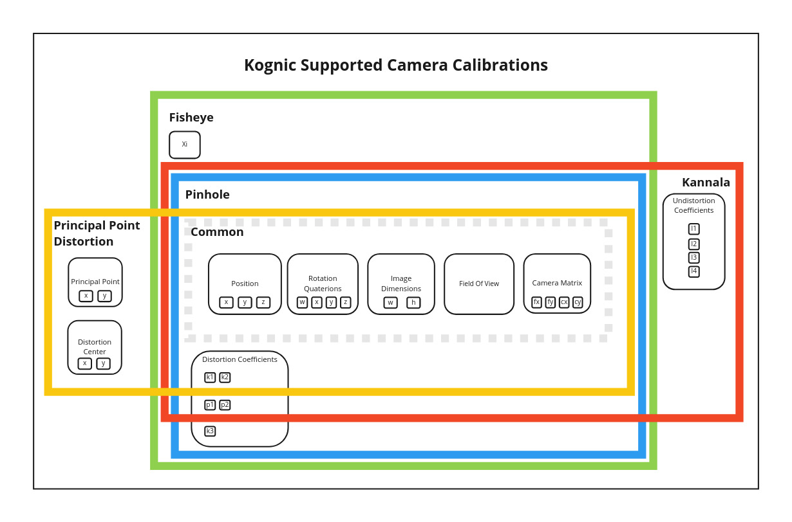

The Camera calibration format is based on [OpenCVs](https://docs.opencv.org/3.4/d4/d94/tutorial_camera_calibration.html) format and
this [paper](http://www.robots.ox.ac.uk/~cmei/articles/single_viewpoint_calib_mei_07.pdf). The different camera types supported are: `PINHOLE`, `FISHEYE`, `KANNALA`, `PRINCIPALPOINTDIST`, and `FUSEDCYLINDRICAL`.
If your calibration model is not supported, you can also provide a [custom camera calibration](cameras-custom.md) where 
you provide the implementation in the form of a WebAssembly module.



### Common

All camera calibrations have the following attributes


| Key                   | Value                         | Parameters             |
|:----------------------|:------------------------------|:-----------------------|
| `rotation_quaternion` | A `RotationQuaternion` object | `w`, `x`, `y`, `z`     |
| `position`            | A `Position` object           | `x`, `y`, `z`          |
| `camera_matrix`       | A `CameraMatrix` object       | `fx`, `fy`, `cx`, `cy` |
| `image_width`         | Integer                       | NA                     |
| `image_height`        | Integer                       | NA                     |
| `field_of_view`       | Float                         | NA                     |

### Pinhole

The `PINHOLE` camera model expands the common model with:

| Key                       | Value                             | Parameters                   |
|:--------------------------|:----------------------------------|:-----------------------------|
| `distortion_coefficients` | A `DistortionCoefficients` object | `k1`, `k2`, `p1`, `p2`, `k3` |

```python reference
https://github.com/annotell/kognic-io-examples-python/blob/master/examples/calibration/create_pinhole_calibration.py
```

### Fisheye
The Fisheye camera model expands the `PINHOLE` model with the following

| Key  | Value | Parameters |
|:-----|:------|:-----------|
| `xi` | Float | NA         |

```python reference
https://github.com/annotell/kognic-io-examples-python/blob/master/examples/calibration/create_fisheye_calibration.py
```


### Kannala
The `KANNALA` camera model changes and expands the `PINHOLE` with the following

| Key                         | Value                                                                                                                                 | Parameters       |
|:----------------------------|:--------------------------------------------------------------------------------------------------------------------------------------|:-----------------|
| `distortion_coefficients`   | A `KannalaDistortionCoefficients` object. The distortion parameters `k3`, `k4`, if available, can be assigned to `p1` and `p2` respectively. That is `p1=k3` and `p2=k4`. | `k1`, `k2`, `p1`, `p2` |
| `undistortion_coefficients` | A `UndistortionCoefficients` object.                                                                                                  | `l1`, `l2`, `l3`, `l4` |

```python reference
https://github.com/annotell/kognic-io-examples-python/blob/master/examples/calibration/create_kannala_calibration.py
```

### Principal point distortion

The principal point distortion model consists of the common attributes plus

| Key                                                                          | Value                                           | Parameters                       |
|:-----------------------------------------------------------------------------|:------------------------------------------------|:---------------------------------|
| `principal_point_distortion_coefficients`                                    | A `PrincipalPointDistortionCoefficients` object | `k1`, `k2`                       |
| `lens_projection_coefficients` (optional. Default to values for model SF806) | A `LensProjectionCoefficients` object           | `c1`, `c2`,`c3`, `c4`,`c5`, `c6` |
| `distortion_center`                                                          | A `DistortionCenter` object                     | `x`, `y`                         |
| `principal_point`                                                            | A `PrincipalPoint` object                       | `x`, `y`                         |

```python reference
https://github.com/annotell/kognic-io-examples-python/blob/master/examples/calibration/create_principal_point_distortion_calibration.py
```

### Fused cylindrical

The fused cylindrical model consists of the common attributes plus

| Key                                                        | Value                                                                   | Parameters       |
|:-----------------------------------------------------------|:------------------------------------------------------------------------|:-----------------|
| `cut_angles_degree`                                        | A `CutAngles` object. Note these angles should be expressed in degrees. | `upper`, `lower` |
| `vertical_fov_degree`  (optional. Default 72.5 degrees)    | Float. Note this angle should be expressed in degrees.                  | NA               |
| `horizontal_fov_degree` (optional. Default 93 degrees)     | Float. Note this angle should be expressed in degrees.                  | NA               |
| `max_altitude_angle_degree` (optional. Default 90 degrees) | Float. Note this angle should be expressed in degrees.                  | NA               |

```python reference
https://github.com/annotell/kognic-io-examples-python/blob/master/examples/calibration/create_fused_cylindrical_calibration.py
```

### Cylindrical

The cylindrical model consists only of the common attributes. There are no extra attributes to set for this model.

```python reference
https://github.com/annotell/kognic-io-examples-python/blob/master/examples/calibration/create_cylindrical_calibration.py
```
### Principal point fisheye

The principal point fisheye model consists of the common attributes plus

| Key                                                                          | Value                                        | Parameters                               |
|:-----------------------------------------------------------------------------|:---------------------------------------------|:-----------------------------------------|
| `principal_point_fisheye_coefficients`                                       | A `PrincipalPointFisheyeCoefficients` object | `alpha_l`, `alpha_r`, `beta_u`, `beta_l` |

```python reference
https://github.com/annotell/kognic-io-examples-python/blob/master/examples/calibration/create_principal_point_fisheye_calibration.py
```

