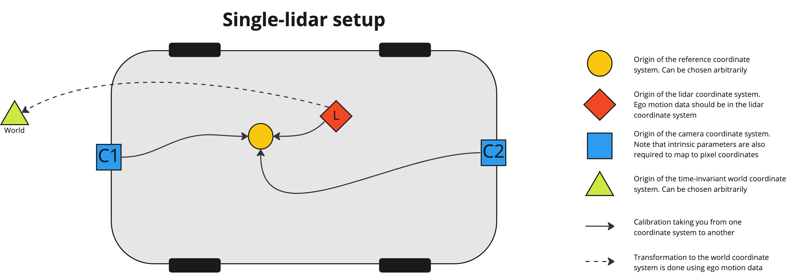
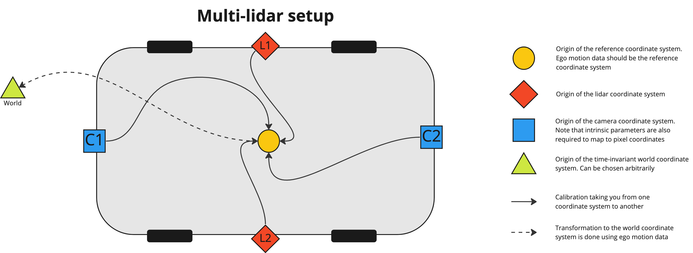

Scenes such as `lidars_and_cameras_sequence` need to be able to combine the data from different sensors and from
different instants in time. This is done by transforming the recordings with sensor [calibrations](calibrations/overview.md) and 
the ego motion data. This section describes how this is done in 3D space and provides a summary about the coordinate 
systems that different kinds of data is expressed in. For camera sensors, we also need to be able to map
3D points to pixel coordinates in 2D. This is done using intrinsic parameters of the camera and these vary depending
on the type of the camera. Refer to [camera calibrations](./calibrations.md#camera) for more information about this.

## The reference coordinate system and calibrations

Each sensor has its own coordinate system in 3D space that depends on its location and orientation on the ego vehicle.
Being able to transform measurements between these sensor coordinate systems is important. To do this, a _reference
coordinate system_ is defined which works as a middle man between the sensor coordinate systems. The reference coordinate 
system can be chosen arbitrarily relative to the ego vehicle. By defining a calibration function $C_i$ for sensor $i$ 
we can map a point $\vec{x_i}$ to the reference coordinate system in the following way

$$
\vec{x_R} = C_i(\vec{x_i})
$$

In the same way we can map points from all other sensors to the reference coordinate system. Subsequently, we can also
map a point from coordinate system $i$ to coordinate system $j$ by applying the inverse of the calibration

$$
\vec{x_j} = C_j^{-1}(C_i(\vec{x_i}))
$$

## The world coordinate system and ego motion data

With this, we can now express points in coordinate systems local to the ego vehicle. This is great, but sometimes it is 
also valuable to express points recorded at different times in the same coordinate system. We call this 
the _world coordinate system_ since it is static in time. We can transform a point to the world coordinate system using ego
motion data, which describes the location and orientation of the ego vehicle at any given time. With the ego motion data
we can transform a point $\vec{x_t}$ to the world coordinate system with
$$
\vec{x_w} = E_t(\vec{x_t})
$$

Subsequently, we can also transform a point recorded at time $t$ to the coordinate system at time $t'$ by applying the 
inverse of the ego transformation function

$$
\vec{x_{t'}} = E_{t'}^{-1}(E_t(\vec{x_t}))
$$

This can be used to compensate each lidar point for the motion of the ego vehicle, a process also known as 
[motion compensation](./scenes/lidars_with_imu_data.md). It is highly recommended to motion compensate point clouds
since lidar points are recorded at different instants in time. This can be done by providing high frequency ego motion 
data (IMU data) when creating a scene. 

## Single-lidar case

The image below displays how the different sensors relate to each other in 3D space in the single-lidar case. Note that 
the ego motion data should be expressed in the lidar coordinate system.

## Multi-lidar case

In the multi-lidar case (see image below) there are multiple point clouds, each in their own lidar coordinate system.
These are merged into one point cloud in the reference coordinate system during scene creation since it's more efficient
to annotate one point cloud rather than several. If IMU data is available, we can also compensate for the ego motion so
that each point is transformed to the reference coordinate system at the frame timestamp. This is done by applying
$$
\vec{x_w} = E_t(C_i(\vec{x_{i,t}})) \\

\vec{x_{t'}} = E_{t'}^{-1}(\vec{x_{w}})
$$

where $\vec{x_{i,t}}$ is the point expressed in the lidar coordinate system of lidar $i$ at time $t$ and $\vec{x_{t'}}$ 
is the point expressed in the reference coordinate system at the frame time $t'$. It is recommended to provide IMU data 
so that motion compensation can be utilized. Since the merged point cloud is expressed in the reference coordinate 
system we also expect any ego motion data to be expressed in the reference coordinate system. 

## Different coordinate systems for different kinds of data

Different kinds of data are expressed in different coordinate systems depending on whether it's single-lidar or 
multi-lidar. This is summarized in the table below where we can see that ego motion data should be expressed
in the lidar coordinate system in the single-lidar case but in the reference coordinate system in the multi-lidar case
for example. 

| Type of data                        | Single-lidar     | Multi-lidar |
|:------------------------------------|:-----------------|:------------|
| Ego poses & IMU data                | Lidar            | Reference   |
| OpenLABEL export  3D geometries | Lidar            | Reference   |
| OpenLABEL export  2D geometries | Pixel            | Pixel       | 
| Pre-annotations  3D geometries  | Lidar            | Reference   |
| Pre-annotations  2D geometries  | Pixel            | Pixel       | 

