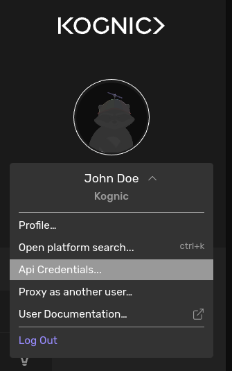

# API Client Overview

Kognic provides HTTP APIs to our client-facing services, and an API client library ([`kognic-io`](https://pypi.org/project/kognic-io/)), to wrap basic API calls and simplify calling the APIs from Python code.

## Authentication

Authentication is handled by [kognic-auth](https://pypi.org/project/kognic-auth/), a Python 3 library providing foundations for Kognic Authentication on top of the requests library.

The authentication builds on the standard Oauth 2.0 Client Credentials flow. There are a few ways to provide authentication credentials to our API clients. Kognic Python clients such as in kognic-query or kognic-io accept an `auth` parameter that can be set explicitly. Alternatively, one can set environment variables that point to the Kognic credentials file. See examples below.

## Generating Credentials

The credentials file that contains the Kognic Client ID and the Kognic Client secret, can be generated in the [Kognic web application](https://app.kognic.com) by clicking on "Api Credentials..." in the user menu, followed by clicking on the "Generate Credentials" button.



The credentials file should be saved in an appropriate directory, such as `~/.config/kognic/credentials.json`.

## Examples

There are a few ways to set your credentials in auth.

- Set the environment variable `KOGNIC_CREDENTIALS` to point to your Kognic Credentials file, by issuing the command `export KOGNIC_CREDENTIALS=~/.config/kognic/credentials.json`
- Set the environment variables `KOGNIC_CLIENT_ID` and `KOGNIC_CLIENT_SECRET`
- Set the `auth` parameter to the credentials file path, such as `auth="~/.config/kognic/credentials.json"`
- Set the `auth` parameter to credentials tuple, such as `auth=(<client_id>, <client_secret>)`

By default, Kognic API clients use the credentials set in environment variable(s). To create an authenticated kognic-io client, assuming the environment variable(s) are set correctly, simply do:

```python
from kognic.io.client import KognicIOClient

api_client = KognicIOClient()
```

Otherwise, one can override the credentiails explicitly:

```python
from kognic.io.client import KognicIOClient

api_client = KognicIOClient(auth="~/.config/kognic/credentials.json")
```

Under the hood, they all use the AuthSession class which is implements a requests session with automatic token refresh.

