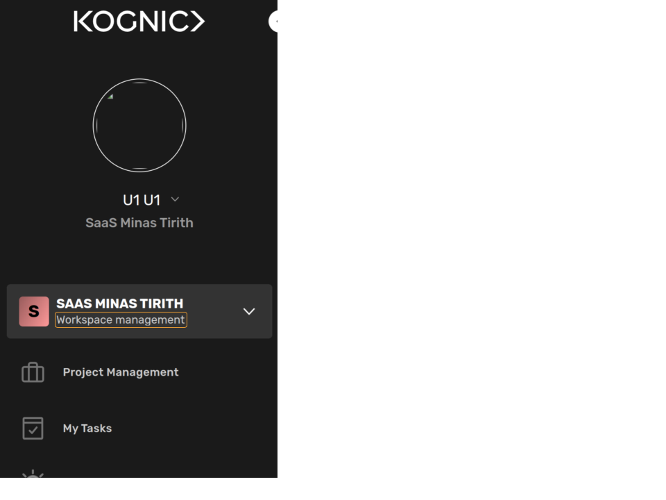
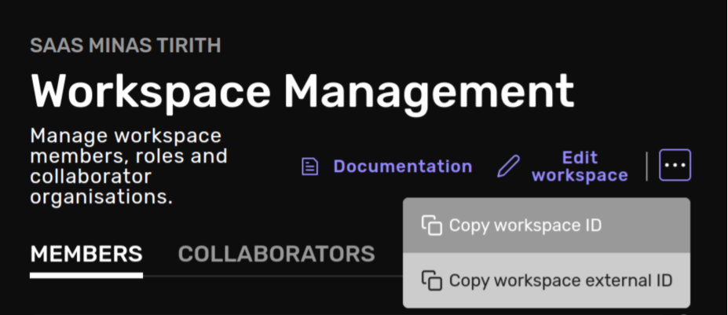

:::info Do I need to read this page?
If you have already gone through the [quickstart](./getting-started/quickstart.mdx) page then **you usually don't have to read this page**. This is page covers more background information.
:::

Kognic provides HTTP APIs to our client-facing services, and an API client library ([`kognic-io`](https://pypi.org/project/kognic-io/)), to wrap basic API calls and simplify calling the APIs from Python code.

## Authentication

Authentication is handled by [kognic-auth](https://pypi.org/project/kognic-auth/), a Python 3 library providing foundations for Kognic Authentication on top of the requests library.

The authentication builds on the standard Oauth 2.0 Client Credentials flow. There are a few ways to provide authentication credentials to our API clients. Kognic Python clients such as in kognic-query or kognic-io accept an `auth` parameter that can be set explicitly. Alternatively, one can set environment variables that point to the Kognic credentials file. See examples below.

## Generating Credentials

The credentials file that contains the Kognic Client ID and the Kognic Client secret, can be generated in the [Kognic web application](https://app.kognic.com) by clicking on "Api Credentials..." in the user menu, followed by clicking on the "Generate Credentials" button.


The credentials file should be saved in an appropriate directory, such as `~/.config/kognic/credentials.json`.

## Examples

There are a **few different** ways to set your credentials in auth.

- Set the environment variable `KOGNIC_CREDENTIALS` to point to your Kognic Credentials file, by issuing the command `export KOGNIC_CREDENTIALS=~/.config/kognic/credentials.json`
- Set the environment variables `KOGNIC_CLIENT_ID` and `KOGNIC_CLIENT_SECRET`
- Set the `auth` parameter to the credentials file path, such as `auth="~/.config/kognic/credentials.json"`
- Set the `auth` parameter to credentials tuple, such as `auth=(<client_id>, <client_secret>)`

By default, Kognic API clients use the credentials set in environment variable(s). To create an authenticated kognic-io client, assuming the environment variable(s) are set correctly, simply do:

```python
from kognic.io.client import KognicIOClient

api_client = KognicIOClient()
```

Otherwise, one can override the credentiails explicitly:

```python
from kognic.io.client import KognicIOClient

api_client = KognicIOClient(auth="~/.config/kognic/credentials.json")
```

Under the hood, they all use the AuthSession class which is implements a requests session with automatic token refresh.

## Specifying a workspace
From kognic-io v2.4.0 you can specify a workspace to use when uploading data, for users with access to multiple workspaces this is mandatory.

To find the workspace you want to upload data to, select it from the drop down:


click on workspace managment:


and find the copy option in the top right hand corner:



When you create your kognic-io client you can now specify this id and it will be used when *uploading data*:

```python
from kognic.io.client import KognicIOClient

api_client = KognicIOClient(write_workspace_id=<Some workspace uuid>)
```

## Proxy Configuration

If your organizations' network policy requires HTTP(S) traffic to be proxied out via a specific host, then you should configure this via your OS or execution environment. `kognic-io` uses Python's `urllib` which [will pick up the proxy configuration from your OS and environment variables](https://docs.python.org/3/library/urllib.request.html#urllib.request.getproxies).

The correct proxy host/address to use depends on the network configuration within your organization, so reach out to your internal IT support for details.

For example:

```
export HTTPS_PROXY='http://10.9.8.7:1234'
```
