import Tabs from "@theme/Tabs";
import TabItem from "@theme/TabItem";

# Create and setup your project

This guide will walk you through the essential steps to create and set up your project. By following these instructions, you'll ensure a smooth start and lay a solid foundation for your work. Let's begin with the key elements you need to consider when initiating your project. If you want a further deep dive into each topic, you can read more in our [platform documentation](https://docs.kognic.com)

There are 5 steps to configure a project in the Kognic platform:

1. **Create the project**
2. **Create your annotation instruction**
3. **Create your first request**
4. **Upload your data**
5. **Add your team to the request**

This guide will cover all five steps one by one where you will in the end have a request for annotating a camera image ready to go.

#### Prerequisites

To be able to follow this guide you need a Kognic account with Workspace role Project Manager & Developer or Admin, lets get started!

## Create project

Projects are used to group and organize annotation work in the Kognic platform. Inside the project, the annotation work is further organized into annotation requests detailing what data to annotate and how. Below is a guide on how to create a new project.

1. Login to the [app](https://app.kognic.com) and navigate to the Project management page

   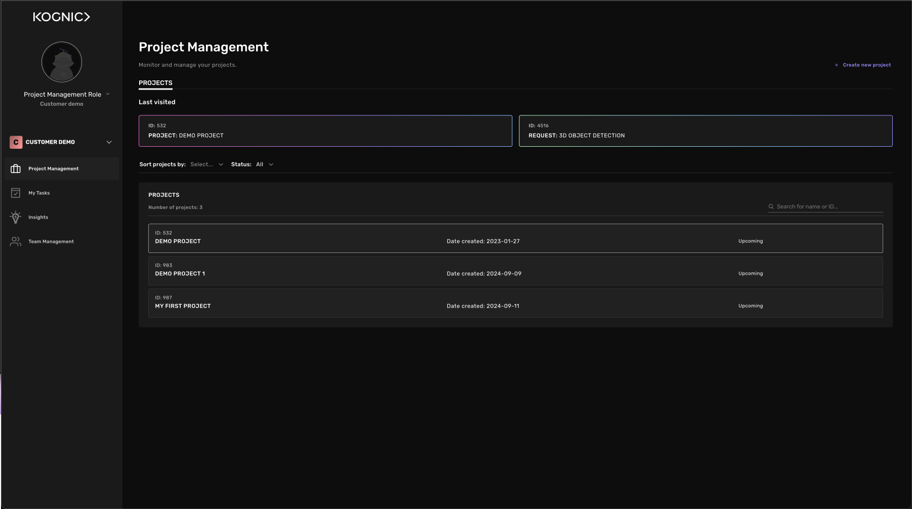

2. In the top right corner, press “Create new project”
3. Create your project by giving it a name and external id, then press Create project. The external id is used to access the project through Kognics APIs. If you leave it blank, it will be set to a random UUID.
   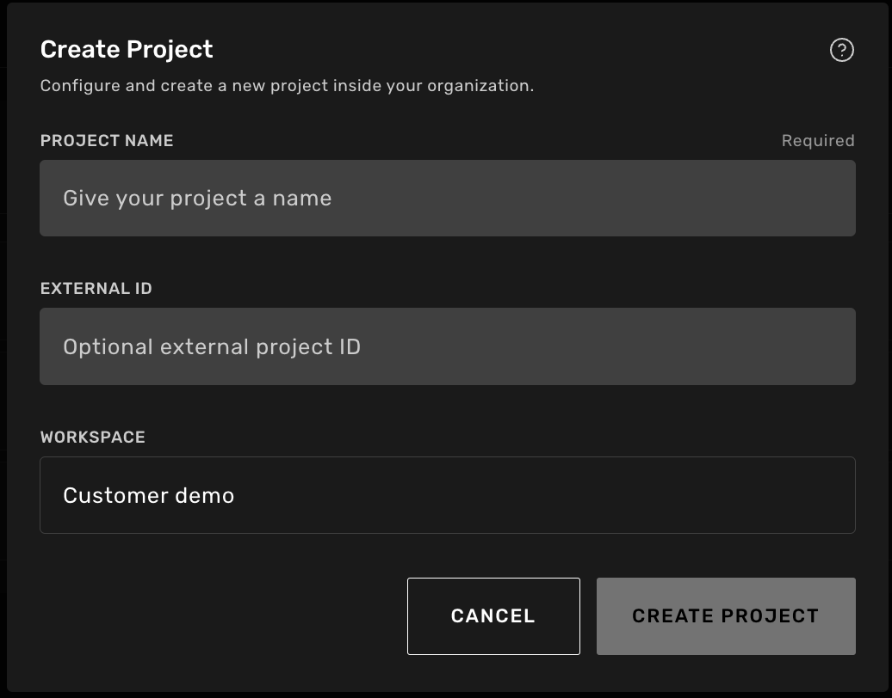
4. Congratulations, you have now created your first project. The project will appear in the project list and you can press it to continue the setup

## Create an annotation instruction

An Annotation Instruction is a specification of what you want to be annotated, but also an explanation or guidance of how you want it to be annotated.

For example, you may specify that you would like to annotate cars and pedestrians in 3D with bounding boxes, which we call Classes. In addition, you may also want to clarify class-related annotation rules in a separate guideline document, for example, that the 3D box annotations around each car should not include the side mirrors.

1. To create a Annotation Instruction, first navigate to the Annotation Instruction tab inside the project. Click on your project in the project list and then click on Annotation Instruction in the top bar, then press Create New Instruction to start.
   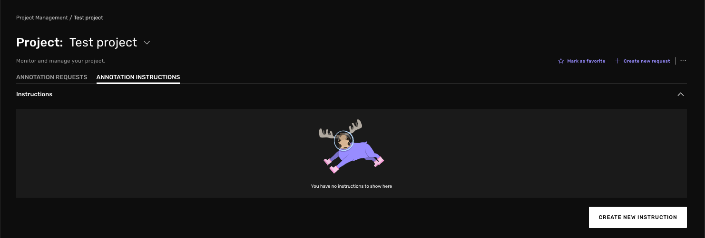
2. In the popup window, give your instruction a name and create it. After you press Create Instruction you will be redirected back to the list of annotation instructions and your new instruction will be listed.
   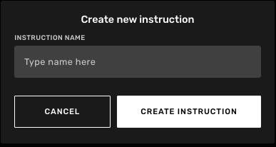
3. Click on new instruction to open it and see all different revisions. Currently there are none. Create one by clicking Create Revision in the top right corner.
   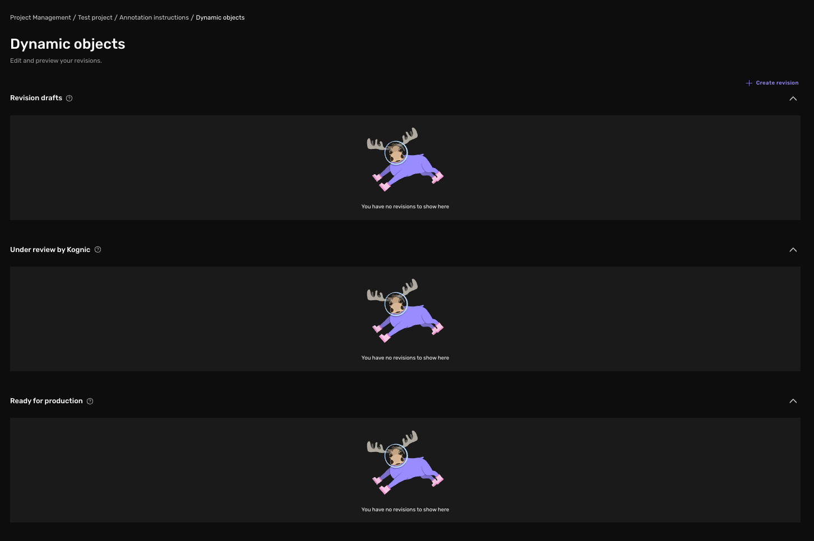
4. In the new popup window, create a new revision by naming it. For Type of revision select New revision draft. Finish the process by clicking Create Revision, upon doing that you will be redirected into the revision.

   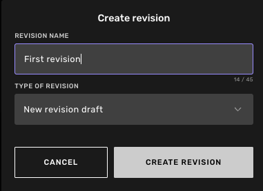

Now its time to start building out the annotation instruction. There are 5 different steps in the process. **Creating the classes (** What classes are needed and with which shape types they shall be annotated with ), creating **Class properties** and adding them to the relevant classes, adding optional **Scene** **Properties** to the inputs, configuring various settings and attaching your guideline.

As an example here we will create the class Car that shall be annotated as a 3D cuboid with 2 different properties.

5. Create a class by clicking **Create new class** in the bottom right corner
6. Change the Geometry type to 3D Bounding box and name the class Car
7. Add “Auto-adjust this Frame” and “Machine Assisted 3D tool” as Automation settings
   
8. To create a class property, go the the class properties tab and press **Create new class property**
9. Select the property type you need and name the property, in this example a True / False property is selected. Then configure the property, for this example. The property value is unique per sensor its visible in and it’s a required property without any pre-selected value.
   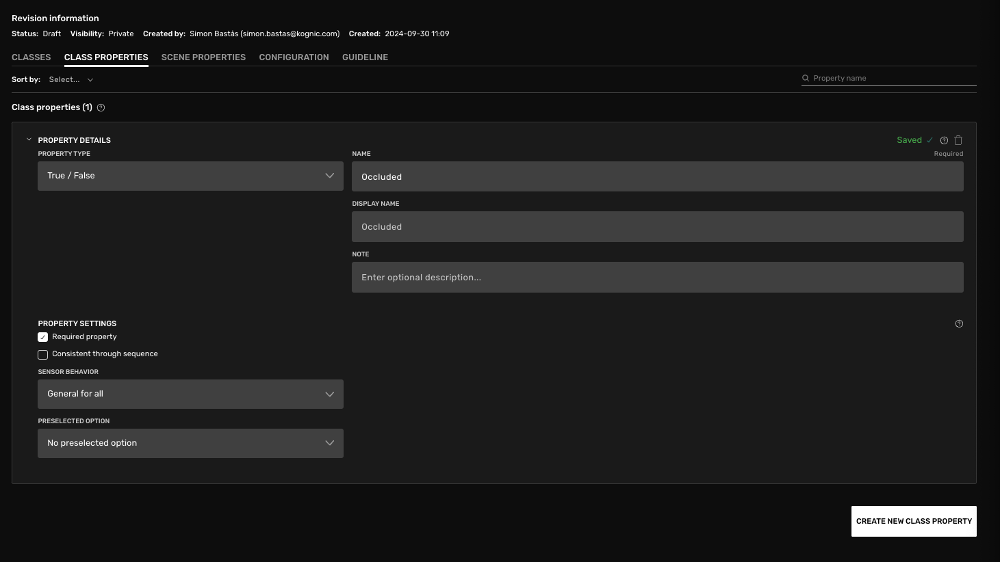
10. Now it’s time to connect the property to the class. Go back to the Classes tab and select the Car class
11. Press Select properties to this class
    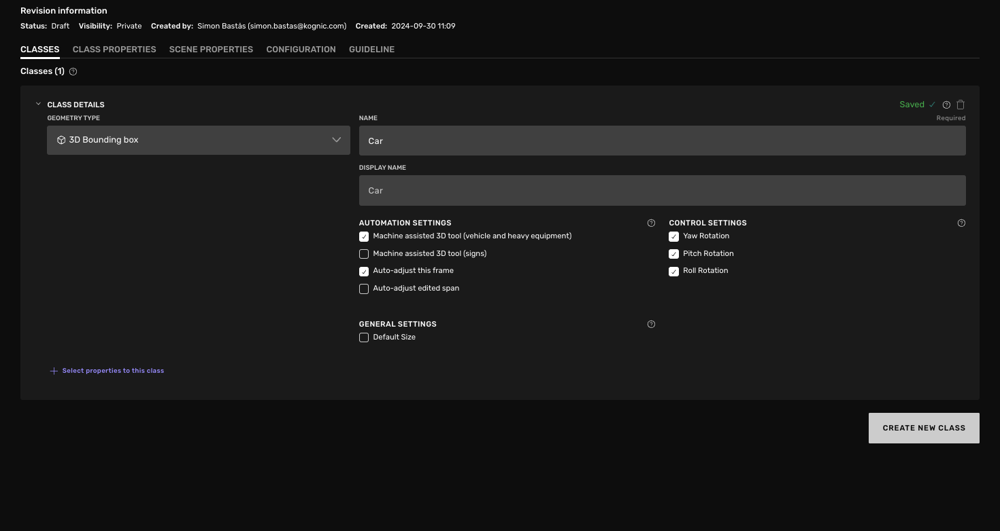
12. Select the property you created and press Save changes
    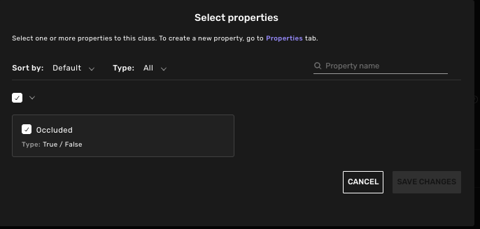
13. Go to configuration, here you can configure your task according to your specific need, to learn about each setting. Press the question mark to read about it. In our case, go to 3D settings and enable “Default to cuboid estimation”
    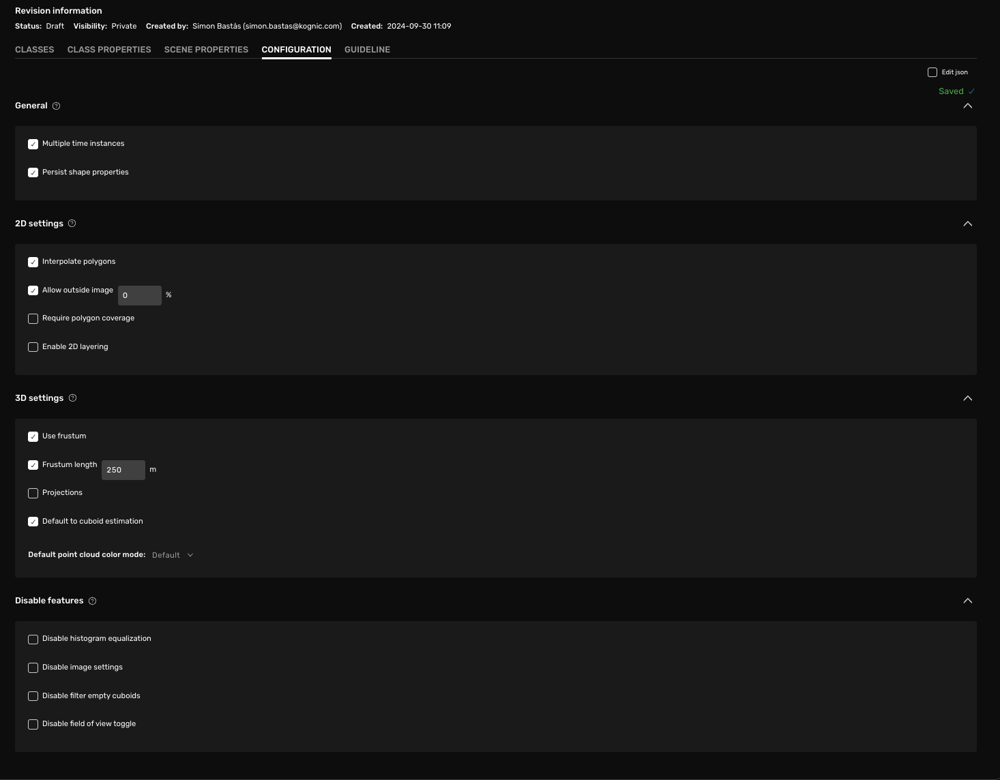
14. Go to the Guideline tab and upload your guideline as a PDF.
15. Now a draft is finished, to test your revision and make sure it behaves as you want, press Preview in the Top-right corner to test it.
16. Select “Multi-lidar” and press Preview, a new tab will open with a demo task with your annotation instruction
17. To the right you will see your configured classes. Draw an object to see that each class has the properties you want. In our case we have the “Car” class with 1 True/False property named Occluded
    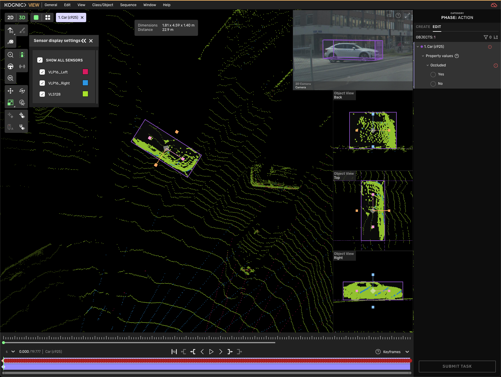
18. If you are happy with the behaviour, go back to the Annotation Instruction and press “Set as ready for production in the top right bar
    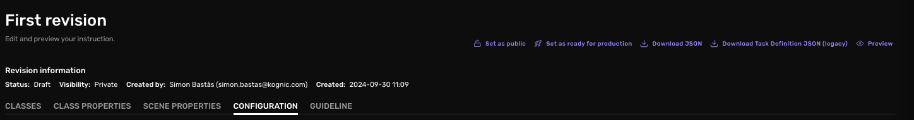
19. In the pop-up, you get the option to get a review from a Kognic expert. Disable that checkbox and click Confirm in this case.

    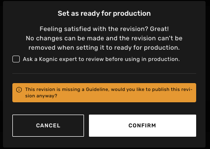

20. Well done! The annotation instruction is now ready to be used when creating a request which is the next step

More details about Annotation Instructions and some tips & tricks are available [here](https://docs.kognic.com/annotation-instruction)

## Create the first request

Annotation request is the core concept in the organization of annotation work at Kognic. The request's configuration specifies what data to annotate (Input batch), how to annotate the data (Annotation Instruction), which process the data should be produced by (Workflow), and who should annotate and quality-assure the data (Team).

1. To get started, open the project you created before and select the Annotation Requests tab. Then locate the Create request button at the top right corner of the project pag
   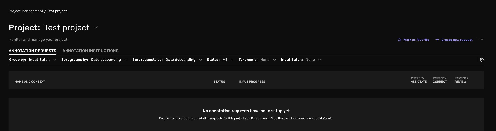
2. Go ahead and create the request. Here there is a variety of settings to go through and select. More details about the different sections can be found by clicking the question mark on the right hand side of each section.
3. **Add Request and Input batch info**

   Name your request and external id. The external id is again used when working with the request via the API. Annotation types are used to categorize the annotations produced in different requests. Select the one that best matches the type of annotations you plan to produce in your request.

4. **Request Producer**

   The organization with the request role Producer is responsible for producing annotated data in the request. Users from this organization are allowed more detailed monitoring and management options and can configure the request team in detail. All to ensure they can successfully monitor and manage the production process.

   In this Request, select your organization as the Request Producer

   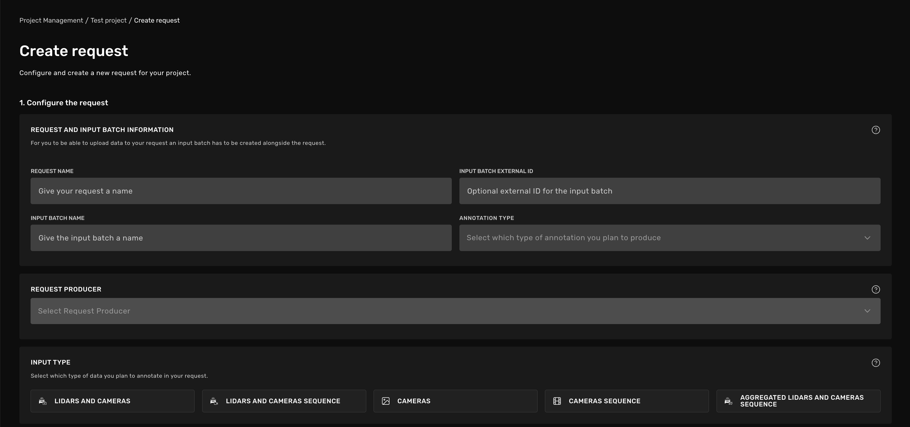

5. **Input type**

   The input type decides what data type you can upload to your newly created input batch and later annotate in the request. For this request, select **Cameras**

   The available input types are:
   | **Input type** | **Description** |
   | ------------------------------------- | ----------------------------------------------------------------------------------------------------------------------------------------------------------------------------------------------------------------------------------- |
   | Lidar and Cameras | A single frame, containing both camera data (from one or multiple cameras) and lidar data. |
   | Lidar and Cameras Sequence | A sequence of frames, containing both camera data (from one or multiple cameras) and lidar data. |
   | Cameras | A single frame of camera data. The data can be from one or multiple cameras. |
   | Cameras Sequence | A sequence of camera frames. The data can be from one or multiple cameras. |
   | Aggregated Lidar and Cameras Sequence | A sequence of frames, containing both camera data (from one or multiple cameras) and lidar data. By using this model the lidar data will be aggregated using your IMU data. This can be useful for example when annotating 3D lines |

6. **Annotation Instruction**

   Select the Annotation Instruction and Revision that you created in the previous step as the Annotation Instruction

7. **Request Workflow**

   The request workflow determines the steps used to produce annotations and in what order. They define what type of steps (tasks) to complete before we have produced a deliverable annotation. For this request, select **Annotate + Full Review + Sampled Review.**

   A comprehensive documentation on Workflows are available on this page [Annotation Workflows - Kognic: Annotation + Dataset Manageme…](https://docs.kognic.com/annotation-workflows).

8. **Review error type**

   The error types are available in the Feedback Tools during Review tasks, and during follow-up Correction tasks. If your organization has many error types configured, you might want to select a subset of error types that are relevant for this request. You can learn more about error types on the page [Error Types - Kognic: Annotation + Dataset Management for Se…](https://docs.kognic.com/error-types)

9. Finish by clicking Create Request
   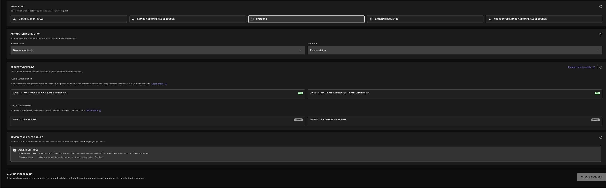

## Upload data

The request configuration is complete, well done! Now it’s time to upload data to the request.

Uploading data is primarily done via the Kognic APIs. To access our APIs, Kognic provides a Python client. For simpler inputs, you can also upload data through the user interface. We'll cover this process in the [Data Orchestration block](https://www.notion.so/Create-and-setup-your-project-guide-111c4e3f60728077acebf963b1e2afdb?pvs=21) below.

1. Create your Kognic API credentials and install the client package
   Follow the [quickstart guide](https://developers.kognic.com/docs/getting-started/quickstart/). Make sure to verify that is works.
2. **Upload and create an Input**

   When uploading data to Kognic, you have two options: you can either send the data directly to a specific request (like the one we created earlier), or just upload it as a standalone scene. Note that a scene will be created in both cases, but in the first case the scene will also be automatically sent to the request for annotation. Note that if you only create a standalone scene you can always add it to a request later on. A scene can be reused in many requests in case you want to annotate the same data in different ways.

   The request above was setup as a Cameras input type request. That means that you can upload a single camera image from one or more cameras in one frame. Follow the code example _Uploading a 2D scene_ [here](https://developers.kognic.com/docs/upload-your-first-scene/) to upload your first scene. All you need is any image you would like to annotate.

   In this case we both want to create the scene and send it to the request that we created. This can be done like the code snippet below, where you specify external IDs for both the project and request (also known as batch). If you don't remember them, don't worry—you can copy them from the app as shown below.

   You can copy the external ids from the app. The project id under the Project main page and press the three dots in the top right corner.

   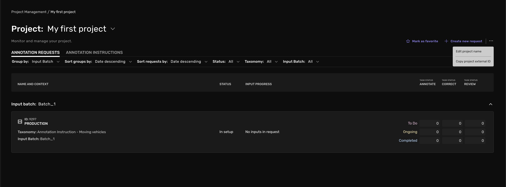
   To copy the Batch external id, go into the request and copy the id in the same fashion

   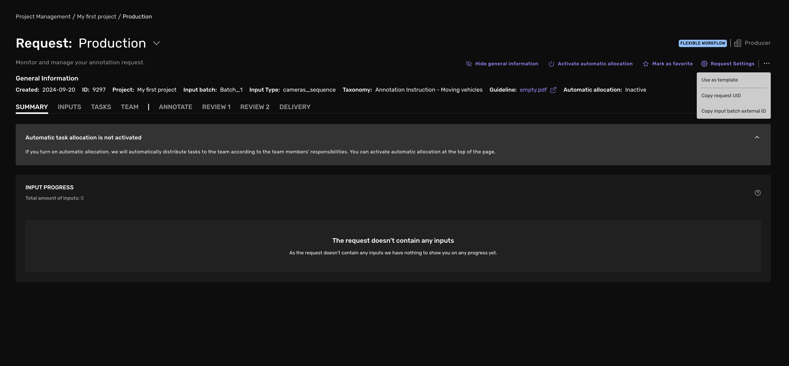

   If you want to know more about Scenes and Inputs and how to work with them you can read more [here](https://developers.kognic.com/docs/kognic-io/working_with_scenes_and_inputs/#creating-inputs-from-scene)

## Data Orchestration

The [Data Orchestration tool](https://app.kognic.com/data-orchestration) is a great way to visualise your uploaded data. Here you can see all of the scenes that you have created. You can filter on certain input types, as well as visualise the actual data in the drawing tool by using the dot-menu on the right as shown below.

Here you can also view in what request a specific scene is annotated in. And if you want to send the scene to a specific request for annotation you can use the Kognic API [as explained here](https://developers.kognic.com/docs/kognic-io/working_with_scenes_and_inputs#creating-inputs-from-scene).

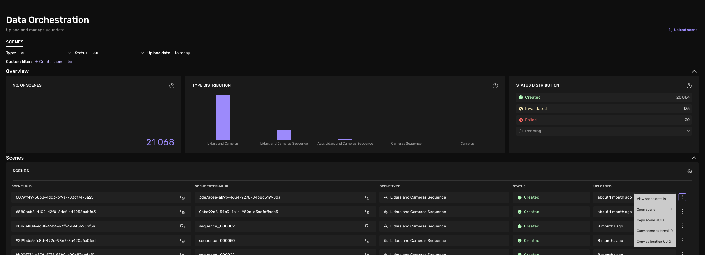

In the upper right corner of the page you can also upload a scene via the UI. This is currently limited to Cameras and Cameras Sequence inputs, but can be of great help to get started.

## Add team & activate request

The last step to setup is to add the team that should work on the request

Two settings determine how a team member gets assigned tasks and what types of tasks they will be assigned - the responsibility and the task allocation type.

### **Task allocation type**

You can have manual or automatic task allocation

**Automatic task allocation e**nsures that the team member will **automatically** get access to tasks of specific types when automatic task allocation has been activated for the request. The team member will be able to work on the tasks as long as there are tasks available of the type/types their responsibility allows them to work on.

Automatically allocated tasks are assigned when the team member clicks "Start a task" on thier “My Tasks” page

If a user have **Manual task allocation** a project manager must manually assign tasks to the user.

### Responsibility

The responsibility determines from which **Workflow stage** the team member will be assigned tasks during automatic task allocation**.** When manual task allocation is activated for a team member, you can assign them any type of task regardless of their responsibility.

**What are workflow stages?**

On the input's way toward getting a delivery-ready annotation, it goes through a series of workflow stages. Each stage corresponds to one action in one of the workflow's different phases, such as the action “Correct” in the phase “Review”.

**Annotate🖋️**
The team member will be able to work on available annotation tasks, which are the base annotation task starting from an empty input

**Correct🖍️**
The team member will be to work on available Review correction tasks during automatic task allocation. A Review correction task contains comments and correction requests from a previous Review tasks.

**Review 👍👎**
The team member can work on available Review tasks during automatic task allocation. A Review task is made to quality assure a previous task.

Now lets add your team.

1. Navigate to the request and the team tab

   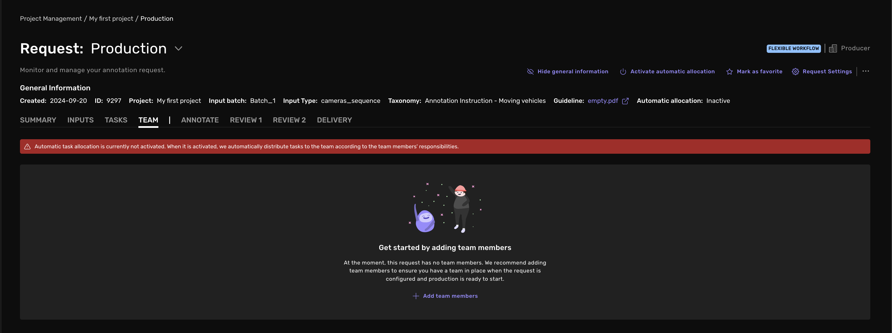

2. Press add your team members

   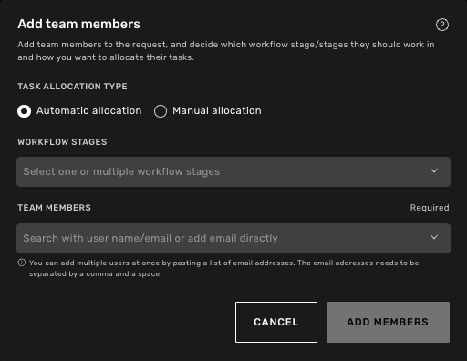

3. Add a team member
   Select the Task allocation type and responsibility you want, then search for their name or email to select them.
4. Press Add Members to finish the setup

   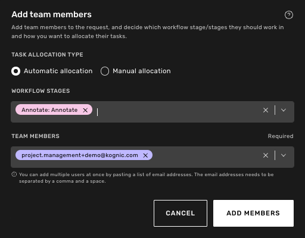
   Read more about a request team [Team - Kognic: Annotation + Dataset Management for Sensor-Fu…](https://docs.kognic.com/team)

5. Great job, lets finish and get to work by pressing Activate automatic allocation on the top right. Team members with Automatic task allocation will now have production tasks to work on under their My Tasks view.

   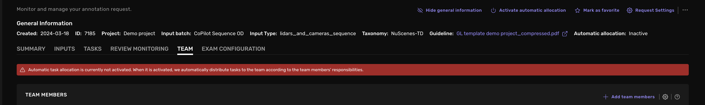
